# README

* Ruby version
Ruby version being run is ruby 2.6.0

* System dependencies

    aws-sdk-s3 ~> 1.36

    faker ~> 1.9

    stripe ~> 4.16

    ultrahook ~> 0.1.5

    see gemfile

* Configuration

* How to run the test suite
Install yarn
    $ npm install -g yarn

Install cypress (see tech stack)

    $ RAILS_ENV=test rails db:create db:schema:load
    $ rails server -e test -p 5002
    $ yarn cypress open -P test

* Deployment instructions

    $ gem install bundler
    $ bundle install

*Database creation and initialization**

    $ heroku run bundle install
    $ heroku run rails db:create
    $ heroku run rails db:migrate
    $ heroku run rails db:seed

# RAILS PROJECT APP - DevMarket

1. Link to [published app on Heroku](https://aqueous-atoll-23921.herokuapp.com/)
2. Link to [Github Repo](https://github.com/ABaulderstone/rails_assesment.git)

# Instructions to use the app. 

The home page as seen below has several links on it. One would be able to browse all the albums and users collections on the site, however  it would not be possible to interact with other users or buy albums without forst signing in or signing up. Both can be accomplished by clicking on the appropriate buttons as seen on the image.

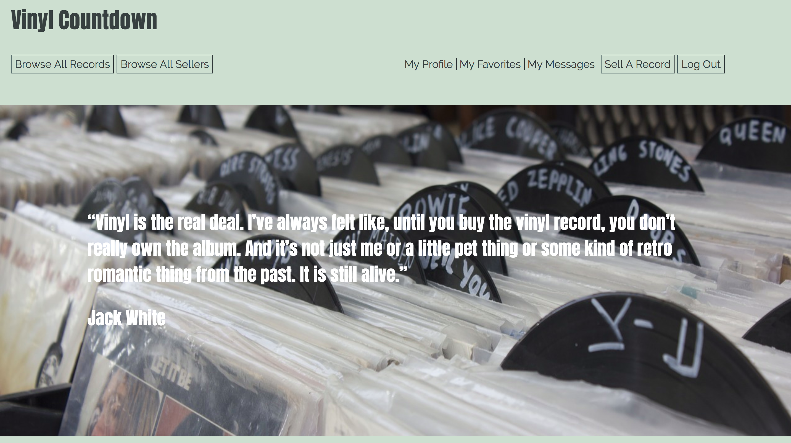

As part of a dynamic display the six records on screen (as seen below) will change depending on which 3 records are the most “favorited” and which are the most recently added. This will make sure the home page is consistently changing. 

The featured artist section of the home page is another feature which is constantly changing. A randomly selected artist from one of the 6 listings displayed on the home page is displayed here. The website will scrape Wikipedia for a summary of them and an image to display here. This is another feature which keeps the home page looking fresh. 

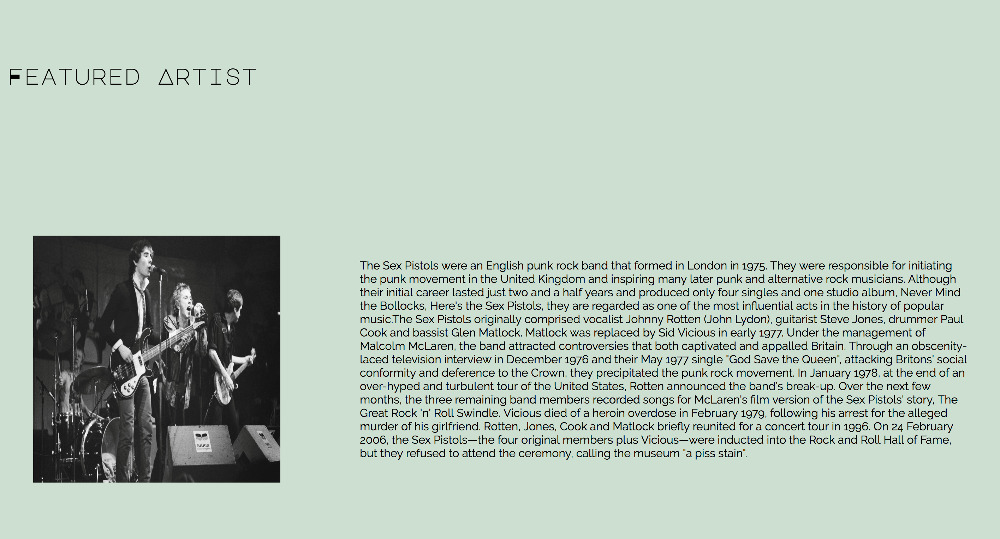

In an attempt to streamline and declutter the process if buying and browsing for records Vinyl countdown has a simple display for all records in the page displayed below with a search function for cases where a user is looking for something specific.  

The view below displays all the information about the record that the seller uploaded. There are two important buttons to pay attention to here. The first button being the “Buy button” and the second one being the “message user” button (which will be expanded upon later). The buy button will redirect the user to Stripe Checkout in order to complete the purchase. 

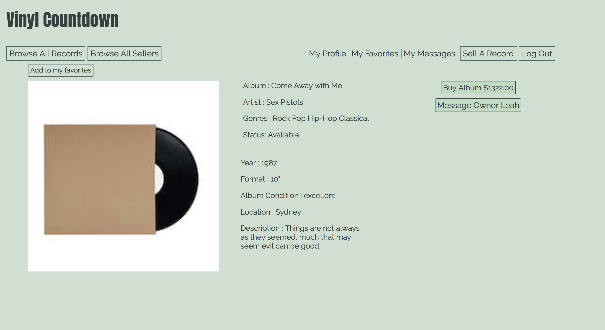

If the buyer needed to negotiate the price witht the seller or simply to organise the delivery method, the messaging feature is where they would do it. As seen below users are able to message each other privately without other users being able to see it.

If a user finds another users collection particularly appealing then they are able to display that users entire collection or search the entire database of users with a search function as seen below. 

Finally, the profile page, as seen below is what a user would see of their own profile. It displays their current listings and the option to directly message that user. Of course if this was your own profile then the direct messaging feature will not be available.  

   
**1. What is the need (i.e. challenge) that you will be addressing in your project?**

Vinyl countdown is a marketplace that exclusively sells vinyl records. Even though there are similar two way market places that already accomplish this such as ebay.com and discogs.com we feel that they are failing to meet certain essential criteria. Ebay allows any item to be sold on it and is therefore not specific enough because a potential customer may end up purchasing something else instead of a vinyl record. Discogs on the other hand, bombards the user with far too much information and therefore diminishes the user experience/interface which could lead to the loss of sales. 

**2. Identify the problem you’re trying to solve by building this particular marketplace App? Why is it a problem that needs solving?**

The specific aims of Vinyl Countdown are as follows:

To create a premium shopping experience that differentiates it from Amazon, Ebay. These marketplaces are incredibly diverse which means there is the potential to lose sales to unrelated products if you are listing a record on them
To build a marketplace that differentiates us from Discoqs.com, which is the current “go-to” vinyl marketplace. 
The differentiating factors which we plan on implementing are:
* Creating a better user interface for selling records i.e. easier to upload and easier to buy.
* Remove unnecessarily information which clutters the experience.
* Creating a community surrounding Vinyl records, exclusively for the resale of records. Direct messaging on the application itself will help facilitate this. 
* Display the most recently added records and the most favorited records/ 
* Display a “featured-artist” image and information. This will be based on a randomly selected album from the current number of listings. 

**Describe the project will you be conducting and how your App will address the needs.**

Vinyl Countdown will be a two sided marketplace where users will be able to buy and sell individual records. The current sites are either not specific enough or have a sub standard UI/Ux. This puts vinyl countdown in a unique position to capitalize on an already established industry, with a better product. 

**Describe the network infrastructure the App may be based on.**
Puma is the standard web-sever used for ruby-on-rails which was used during the development phase of the project. The team elected to keep the standard Puma set up based on the fact that it was incredibly fast. What makes Puma so fast is the careful use of a Ragel extension to provide fast, accurate HTTP 1.1 protocol parsing.
The network infrastructure for our app will be hosted on Heroku. Herko is a cloud server hosting platform.  We deployed into Heroku using Git. We are using Heroku Postgres which is a managed SQL database. The reasons behind outsourcing the server side of our application are the same as reasons outlined above for cloud storage. In a nutshell using cloud servers is a far more practical solution than running your own servers locally. The cost of Heroku was justified because of its ease of use. 
Amazon Simple Storage Service is offered by Amazon Web Services which provides object storage through a web service interface. Amazon S3 was used In order to avoid storing images locally. Local storage has several shortcomings including the machine to be constantly running and the finite nature of the hard drive. Amazon S3 elegantly takes care of both problems by leveraging cloud storage. 

**Identify and describe the software to be used in your App.**

Ruby on rails

Ruby on Rails, is a server-side web application framework written in Ruby under the MIT License. Rails is a model–view–controller framework, providing default structures for a database, a web service, and web pages. The team embraced the concept of convention over configuration and leveraged the “rails magic” to the fullest extent of our knowledge. Only very small adjustments were made to the stock ruby on rails platform e.g. using the PostgresQL database.

Javascript

JavaScript, is a high-level, interpreted programming language that conforms to the ECMAScript specification. JavaScript has curly-bracket syntax, dynamic typing, prototype-based object-orientation, and first-class functions. JavaScript was used for the interaction with the “Buy button” in order to redirect the user to Stripe checkout. JavaScript was also used for the hamburger menu in the navigation bar. 

SCSS

Sassy CSS or SCSS was used the style the application. An SCSS file was auto-generated when setting up the the initial ruby on rails application. Several other SCSS files were used to target different views (e.g. the show view for listings will have its own SCSS file).

Trello and Google sheets
Trello and google sheets were used concurrently for project management. Major features were tracked via Trello. Bug fixes and minor edits were logged on the google sheets log bog. Finally google sheets was used again for a project management gantt chart in order to track the projects progress. 

Slack

Slack is a messaging app used for communication. Slack was largely used after hours or to send updates when team members we out of the room. Communication for the most part was done face to face as the team members agreed to be present from 9:00-17:00 on weekdays. 

Amazon S3

Amazon Simple Storage Service is offered by Amazon Web Services which provides object storage through a web service interface. Amazon S3 was used In order to avoid storing images locally. Local storage has several shortcomings including the machine to be constantly running and the finite nature of the hard drive. Amazon S3 elegantly takes care of both problems by leveraging cloud storage. 
Amazon S3 was used because it is cost effective,  secure, always available, simple to use and easy to manage. 
Instead of the fixed price of physical local hard drive, you are only charged for the amount of space occupying the cloud storage. This makes the price of the storage dynamic and significantly more cost effective than local storage. The price is also cheaper than other cloud storage options. 
Amazon S3 is always available because of its incredible infrastructure and negates the problems associated with local storage. Local storage is

Heroku

Herko is a cloud server hosting platform. The reasons behind outsourcing the server side of our application are the same as reasons outlined above for cloud storage. In a nutshell using cloud servers is a far more practical solution than running your own servers locally. The cost of Heroku was justified becasue of its ease of use. 

Stripe

Stripes software allows individuals and businesses to make and receive payments over the Internet. Stripe provides the technical, fraud prevention, and banking infrastructure required to operate online payment systems.

VScode

Visual Studio Code is a source-code editor developed by Microsoft for Windows, Linux and macOS. This text editor was selected because the team members were most familiar with it and it was fully operational on both Linux and macOS. The features which were leveraged the most during the development were support for debugging, embedded Git control and GitHub, syntax highlighting, intelligent code completion, snippets, and code refactoring.

MacOS & Ubuntu

The operating systems the application was developed onwere MacOS and Ubuntu. MacOS and Ubuntu share some similarities because they are both based on Unix. This helped with collaboration between team members because they then shared a similar terminal and Os behaviours. 

Cypress

Cypress was used for all of our automated testing. It provides the platform for easy and reliable testing for anything that runs in a browser. Cypress allowed the team to write our automated testing.  The simplicity of Cypress allowed the team to Install it in seconds and automate our front-end testing.

Git

Git is a free and open source distributed version control system designed to handle everything from small to very large projects with speed and efficiency. Git was selected for source control because it was most familiar with the team members and is regarded at the industry gold standard. It is also highly compaible with GitHub and Git Kracken.

Gitkraken

GitKraken is a application which provides a graphical user interface for Git. Although all the Git operations are available from within GitKracken the team elected not to use them and instead used the terminal for all git commands. GitKracken sole usage was to visualize the git repository.

GitHub

GitHub is a web-based hosting service for version control using Git. Git-hub was selected because it was the application which was most familiar to the team members and is the industry standard. 

**Identify the database to be used in your App and provide a justification for your choice.**

Our database of choice was PostgreSQL. It was chosen primarily because it is open source and the project budget did not have any funds allocated for for software. PostgresQL also makes the claim of being “The world's most advanced open source database”. PostgresQL has the advantage of being object relational over MySQL, MariaDB and Firebird. This makes PostgresQL extremely flexible and robust, this allows for user-defined objects and their behaviours including data types, functions, operators, domains and indexes. We do not initially take full advantage of PostgresQLs features for the application, however the flexibility of the database leaves the door open for expansion and upscaling the project.

**Identify and describe the production database setup (i.e. postgres instance).**
Postgres is a client/server application and as a user, we only need access to the client portions of the installation. Once installed, Postgresql allows all the associated actions a CRUD.
Each Postgresql session consists of these 3 elements;
* A supervisory Postmaster
* the user's psql program (front-end)
* One or more backend database servers which is the postgres process itself

The fundamental aspect of Postgresql are tables, which in turn are a collection of rows. Each row has the same set of named columns, and each column is of a specific type. Each row also has an unique permanent object identifier.

**Describe the architecture of your App.**

Ruby-on-Rails is a MVC framework which champions convention over configuration. Therefore Vinyl Countdown was built in the MVC architecture pattern. In short anything which manipulated the database was controlled via the model, anything which the user interacted with was displayed by the views and finally all business logic was controlled by the controller files.  
HTTP requests are received from the browser by Heroku - and then forwarded to the action dispatcher which parses the requests and routes them to their respective controllers via the routes.rb file in the config directory. 

As recommended by ruby-on-rails convention a RESTful setup was used to handle all HTTP requests. Therefore the restful verbs: post, get, put/patch and delete were associated with the CRUD operations in the controller; create, read, update and destroy respectively. 
Our various controllers all inherit actions (in the form of ruby methods) from the action controller which handle user sessions, render views, and interact with the models to serve the correct data to our views. 

**Explain the different high-level components (abstractions) in your App.**

* The app follows the MVC pattern decomposing functions into models, controllers, and views
* We are also using various Ruby Gems like Devise, Ransack, aws-sdk-s3
* More complex logic was abstracted out of the controller into service objects.

Vinyl Countdown has one sign up form for all users which will have the same experience with the exception of viewing their own profile. The user details are stored in the user model.  Once signed in the user is redirected to the home page, however now the user has the ability to sell records, buy records and to interact with other users via the internal messaging system. 
When a user sells a record they are directed to the create new listing forms. The information recorded is handled by the listings model which will have a reference to the user who created it. Part of the listings model is concerned with the purchases, i.e. it addresses whether or not the album has been sold. This information is necessary because Vinyl Countdown will not display a record for sale if it has already been purchased. 
The payment model records the vital information information regarding purchases i.e. what was purchased, who purchased it and the purchase id provided by stripe. This is essential in case a customer needs a refund.
Because Vinyl Countdown does not organise postage and it is assumed that the buyer and seller will independently organise the delivery it was necessary to have a messages model in order for a user-user messaging system. This model saved the messages users sent to each other. 
Another feature on our application is an instant messaging system. This encompasses both the conversation and message databases. Only a customer can begin a conversation (by clicking on the ‘enquire’ button of the caterer they wish to talk to), and they can only talk to a caterer. Whilst a caterer can only talk to a customer, and can only chat when the conversation has been initialised. This was achieved through the use of a customer_id and a caterer_id in the conversation model. They both draw from the user database, and use is_caterer to work out which column they should be in. The messages database belongs_to the conversation, as every message a user sends will be to someone.

**Detail any third party services that your App will use.**

Stripe 

Stripe was the third party application used to take payments from users. It was selected for its record of stability, commision transparency, storage of users sensitive information, useability due to its exception documentation and finally its universality because it accepts several different cards from several different countries. 

In terms of stability its track record speaks for itself. Stripe has been established for almost 8 years and is valued at over $20 Billion USD. It has not has a server outage or data leak in that time and continuously updates its security meaning that the storage of users sensitive information is assured. Stripes sizeable market share can be explained by its usability, its excellent documentation covers the transaction and commision fees meaning the user can correctly price their products to account for it. For the above mentioned reasons Stripe was selected over other third party payment apps. 

Amazon S3

Amazon S3 was used In order to avoid storing images locally. Local storage has several shortcomings including the machine to be constantly running and the finite nature of the hard drive. Amazon S3 elegantly takes care of both problems by leveraging cloud storage. 
Amazon S3 was used because it is cost effective,  secure, always available, simple to use and easy to manage. Instead of the fixed price of physical local hard drive, you are only charged for the amount of space occupying the cloud storage. This makes the price of the storage dynamic and significantly more cost effective than local storage. The price is also cheaper than other cloud storage options. 
Amazon S3 is always available because of its incredible infrastructure and negates the problems associated with local storage. Local storage is dependent on power supply, internet connectivity and hardware lifespan.

Heroku

Herko is a cloud server hosting platform. The reasons behind outsourcing the server side of our application are the same as reasons outlined above for cloud storage. In a nutshell using cloud servers is a far more practical solution than running your own servers locally. Heroku, Google cloud and AWS were considered for housing the app. Heroku was ultimately selected because of the additional software installation and maintenance required by AWS and Google cloud. Heroku was slightly more expensive but the convenience was considered to be worth the cost when considering the time frame of the project. Heroku has other acknowledged advantages. 
Like other cloud services,  Heroku us able to scale very quickly and easily. 
As mentioned previously, networking is already setup with Heroku - we don’t have to worry about how our application is going to be able to hook into the internet. Whereas other cloud services require additional software installation and setting up which will not be possible with the time constraints of the project. 
Heroku comes prepackaged with some networking security already in place such as protection from DDOS. 
An advantage that any cloud server has over a local server is that it negates the need to maintain the hardware. Ultimately the cost factor of cloud servers is lower than local servers.

Wikipedia

Wikipedia is a free encyclopedia which is maintained and written by the greater community. Anybody is able to access and contribute to wikipedia for free. Wikipedia is leveraged in this application with a get request to access the artist pages and images of the artists. Because of the level of fame associated with producing a record it is is incredibly likely that a artist page will exist on wikipedia. Wikipedia was selected because it is free and it has an incredibly large database.
Specific web pages were accessed via a get request and there after the information was parased to access the summary of the artist and the appropriate main image. 

**Describe (in general terms) the data structure of marketplace apps that are similar to your own (e.g. eBay, Airbnb).** 
As defined by investopedia - A two-sided market occurs when two user groups or agents interact through an intermediary or platform to the benefit of both parties. Also known as a "two-way market" or a "two-sided network," examples of two-sided markets are seen in a variety of industries and companies.

Examples of two sided marketplace apps similar to our own
* Discogs
* Ebay
* Gumtree

A list of some of the key features are:
A sign-in procedure for authentication and authorisation purposes. This is necessary because of the sensitive personal and financial data that a market place will hold. The main marketplace apps also offer flexible authentication systems, therefore there could be several different methods of authenticating yourself.

A management system for purchases. At a bare minimum there would need to be a record of who bought an item, what that item was, how much the item was and finally a unique id for the payment in order to process refunds if need be. 

Account pages for various users. These pages can be recycled for the vast majority of cases eg. the current user will only need a few minor additional features for their own personal profile view. I.e. the ability to edit it. 

A method of taking payment. This is an essential aspect of  any market place whether it be digital or a physical marketplace. A third party service was used for Vinyl Countdown 
Data Structure As we are using a SQL database, data is stored in tables and columns, rows. The relationship between tables and field types is called a schema. In a relational database, the schema must be clearly defined before any information can be added.

**Discuss the database relations to be implemented.**

Users
A User has many listings, which are dependent on user in case a user deletes their account and will therefore will no longer have albums o be sold
A User has many purchases, A user will be able to make several purchases
A user has one avatar, A user will only have the need for one avatar
A user has many favorite_listings, through favorites. Of course the user will be able to have several albums on their favorites list. 

Listings 
A Listing belongs to a User, in order to know which albums belong to which user
A listing belongs to format, in order to know which format the listing is in. 
A listing has many genres_listings, which is dependent on the listing because if a listing is destroyed then it will no longer have a need for a genre. 
A listing has many genres, which is dependent on the listing because if a listing is destroyed then it will no longer have a need for a genre. 
A listing has one purchase, because it can only be bought once.

Conversations
Conversations belong to, user with a sender and receiver allocated to it
Conversations has many messages, which are dependent on conversations. This is because if a conversation is deleted there will no longer be a need for messages. 

Messages
Messages belongs to conversations
Messages belongs to user. 

Purchases 
Purchases belong to user 
Purchases belong to listing. There is no dependent destroy on the purchases because we need to have a persistent database for purchase records. Regardless if the listing is removed. 
Genre_listings is a join table
Genre_listings belongs to genre
Genre_listings belongs to listings

Genre 
Genre has many genre_listings via the join table 
Genre has many listings

Format 
A Format has many listings, as many listings can have the same format. 
Favorite 
Favorite belongs to users, because we need to know which user to display the favorites on. 
Favorite belongs to favorited, in a polymorphic association set up. 

**Describe your project’s models in terms of the relationships (active record associations) they have with each other.**

Across the eleven tables our models utilise all basic relationships: one to one, one to many, and polymorphic relationships. An example of a has one  relationship would be a listing only having one purchase. An example of a many to one would be a user having many listings. The favorites model made use of the polymorphic association table. This was done so that if Vinyl Countdown were to scale up it would then be possible to add in features such as favorite users.

**Provide your database schema design.**

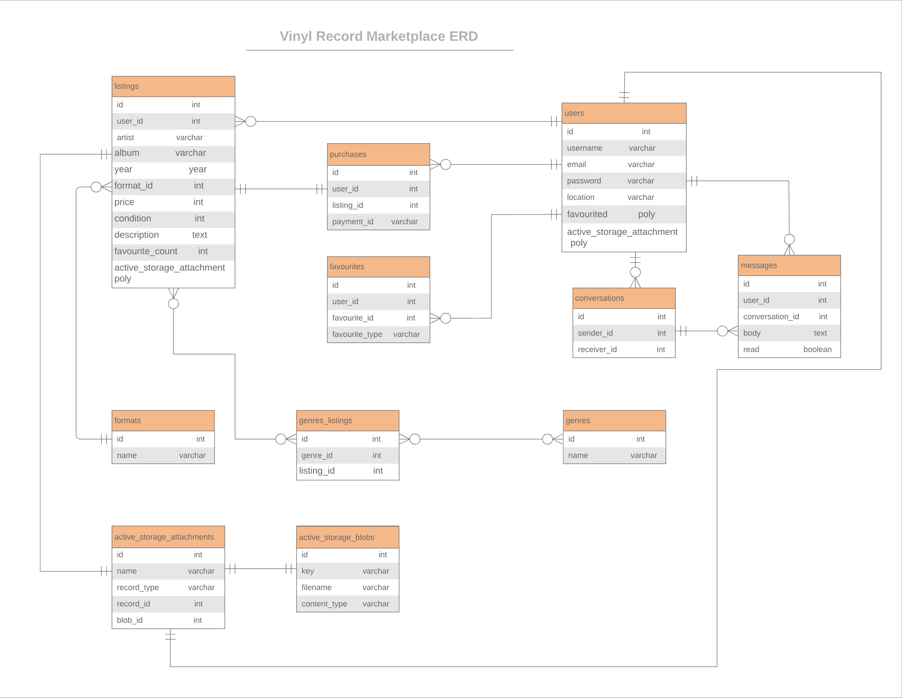

**Provide User stories for your App.**

* As alex I would like to buy vinyl records online so that I can continue to expand my collection. 
As Bruce I would like to list my vinyl collection online for sale so that I can sell the records I no longer want to keep in my collection
* As Josephine I would like to trade vinyl with people instead of buying new records so that I can refine my collection without spending money 
* As Leah I would like to message people without having to give out my personal contact details so that I can communicate safely
* As Bryce I would like to be able to view all the listings from a particular user so that I can see if they have other albums I like

**Provide Wireframes for your App.**
*MOOD BOARDING*
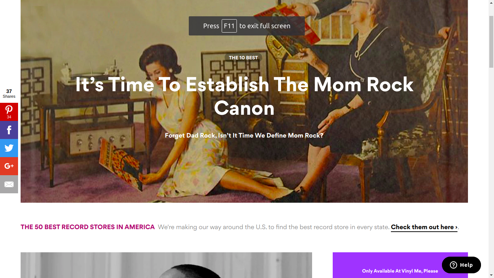
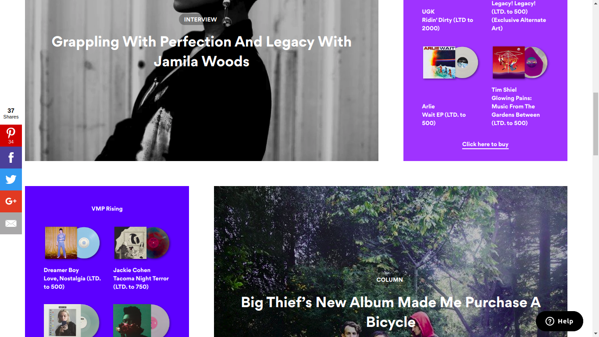
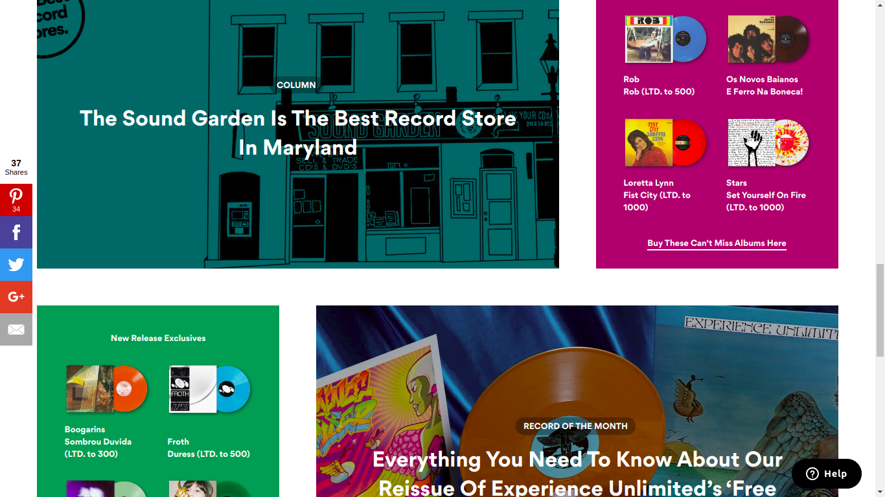

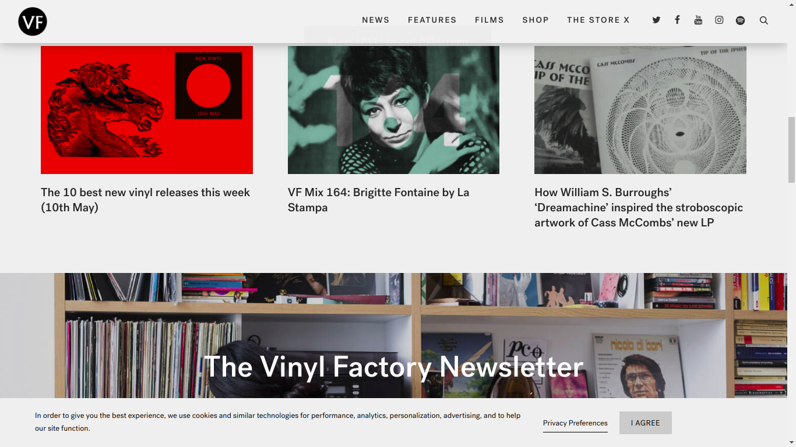

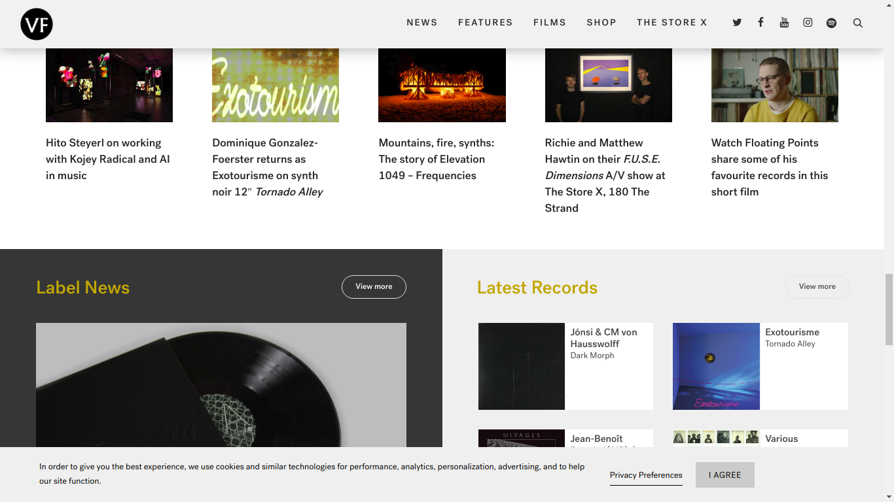

*COlOUR SCHEME*

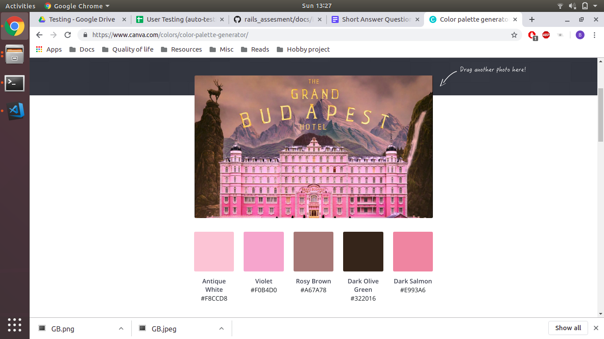

*INITIAL DRAWING*

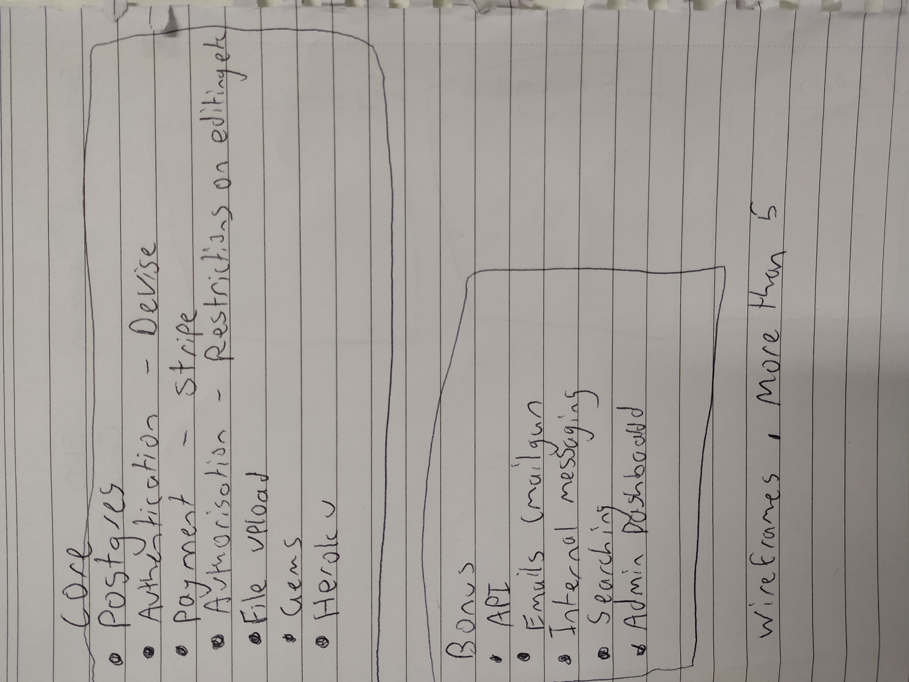

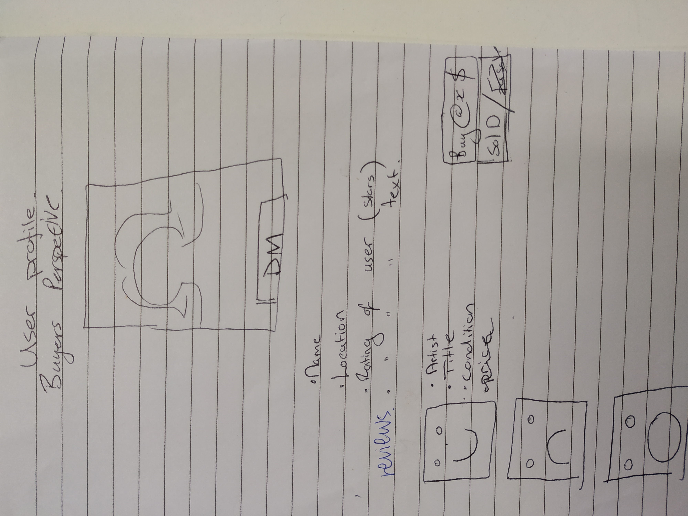
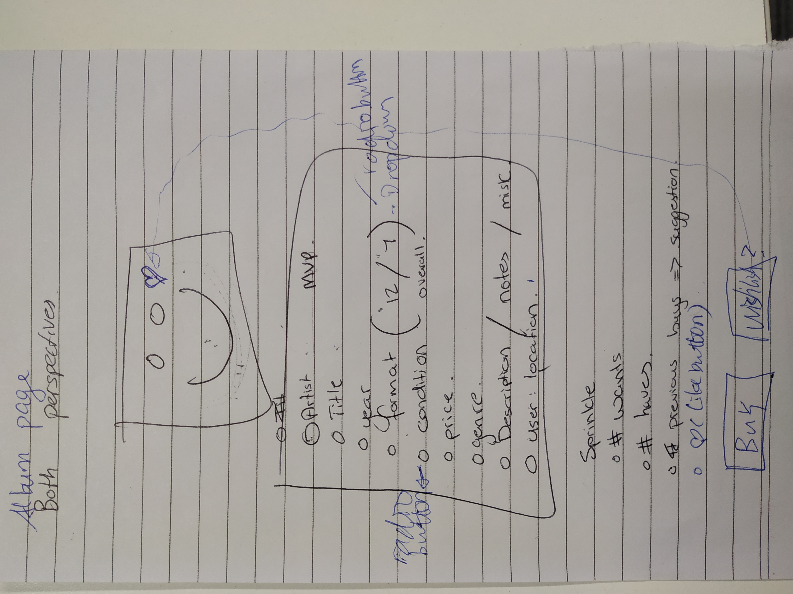

*LO-FI Wire-Frames*

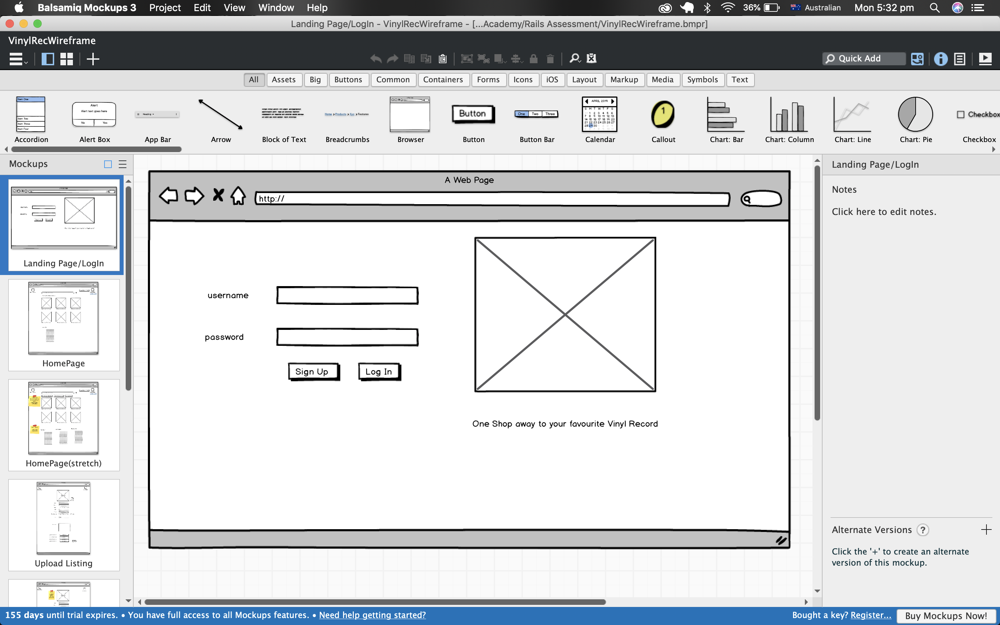

.png)
.png)
.png)
.png)
.png)
.png)
.png)
.png)
.png)
.png)

*DESKTOP MOCKUP*

**Describe the way tasks are allocated and tracked in your project.**

Tasks were assigned by consulting the project timeline gantt chart and checking what needed to be done on that specific day. Thereafter team members volunteered to take on different tasks in pairs or alone. The time criteria for each task was dictated by the gantt chart. Because team members were always present during working hours, they were able to troubleshoot on problems that other team members had. The tasks were then made into sprints and put onto the trello board. 

**Discuss how Agile methodology is being implemented in your project.**

Two daily meetings were held from Monday to Friday. Both meetings were conducted in a stand-up style format. The morning meeting was held at 9am and covered the sprints for the upcoming day, who gets assigned to which task and whether or not somebody will need help with a particular aspect of their task i.e. if they anticipate encountering any blockers in the future. Tasks were assigned by consulting the project timeline gantt chart and checking what needed to be done on that specific day, thereafter team members volunteered to take on different tasks in pairs or alone.

The evening  served as an opportunity to demo the days work. This often involved the completion of a particular feature (e.g. successfully incorporating stripe into the app) if the team agreed that the feature was solid and displayed no obvious bugs then the branch was merged into the dev branch. The last task completed during the meeting is to merge the dev branch into the master branch. 

Agile methodology was implemented by following the agile manifesto. The 12 principles were consulted in order to make sure the team was as efficient as possible and remaned agile. How each principle was interpreted and implemented is discussed below. 

Principle 1: “Our highest priority is to satisfy the customer through early and continuous delivery of valuable software.”
Within the context of the assignment the team interpreted this principle to be focused on delivering a good product on the deadline. 

Principle 2: “Welcome changing requirements, even late in development. Agile processes harness change for the customer's competitive advantage.”
The team went through a rigorous wireframing and planning phase before the first line of code was ever written. That being said, no matter how well planned a project is, there will always be additional features which weren’t accounted for during planning. Our team was continuously prepared for a change in requirements. An example of this was to add in a “favorites” feature late in the development stages of the project. The team adapted to the new feature and incorporated it into the views of the homepage as well. 

Principle 3: “Deliver working software frequently, from a couple of weeks to a couple of months, with a preference to the shorter timescale.”
Within the context of the assignment the team interpreted this principle to be concerned with meeting the timeline goals prescribed by the gantt chart. This meant that team members aimed to have the different features merged into the development branch by the deadline prescribed by the gantt chart. 

Principle 4: “Business people and developers must work together daily throughout the project.”
Because all three team members are developers, one team member role-played as a “business person” during the concept and wireframing phase of the project. This person was responsible for making sure that all business related concerns were addressed in the development of the app.

Principle 5: “Build projects around motivated individuals. Give them the environment and support they need, and trust them to get the job done.”
One of the goals of the ideation phase was to find a project which all members were excited about. This ensured that all three members would be motivated to work on the development of the app. The positive working environment and support was achieved by working in close proximity to each other enabling face to face questions. 

Principle 6: “The most efficient and effective method of conveying information to and within a development team is face-to-face conversation.”
As mentioned in Principle 5, face-to-face time was essential for a positive work environment and maximising support of other group members. Face-to-face conversations were guaranteed throughout the day with two regular stand up meetings and a handful of impromptu meeting throughout the day. The in person communication was far more effective than remote communication. 

Principle 7: “Working software is the primary measure of progress.”
The team prioritised working code over fast code. This meant that it was considered preferable for a gantt chart deadline to be missed because the team member ran over time instead of pushing broken coode. 

Principle 8: “Agile processes promote sustainable development. The sponsors, developers, and users should be able to maintain a constant pace indefinitely.”
The project planning and gantt chart accounted for working hours from 9:00-17:00 Monday to Friday for two weeks. This meant we collectively had 240h of working time. The team considered this ample time to complete the project without having to go into the weekend or after hours. This promoted sustainable development as the team members had enough time to rest in the evenings and on the weekends. 

Principle 9: “Continuous attention to technical excellence and good design enhances agility.”
Within the context of the project and timeline the 9th principle was interpreted to be continuously mindful of writing clean code to implement the design which was outlined by the wireframe. Making the code clean and DRY ensured that other team members could read and understand the code as well as making the code more scalable. 

Principle 10: “Simplicity--the art of maximizing the amount of work not done--is essential.”
The team interpreted the 10th principle to be: keeping the teams focus on the current sprint and narrowing the focus of the days work to what is in front of them. 

Principle 11: “The best architectures, requirements, and designs emerge from self-organizing teams.”
When a team member was assigned/volunteered a task they were left to their own devices to find their own solution. This provided a sense ownership to the team member which gave them extra motivation to see their solution through. 

Principle 12: “At regular intervals, the team reflects on how to become more effective, then tunes and adjusts its behavior accordingly.”

**Provide an overview and description of your Source control process.**

*insert GIT Kraken images*
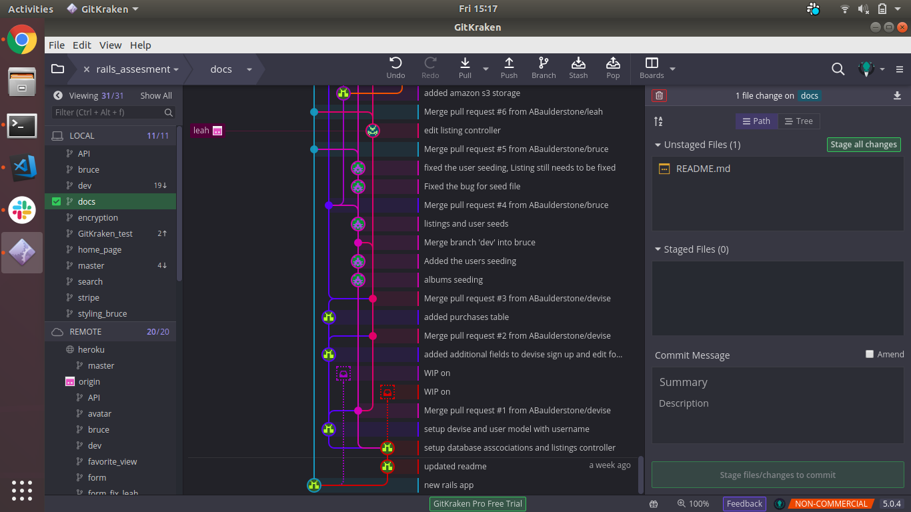
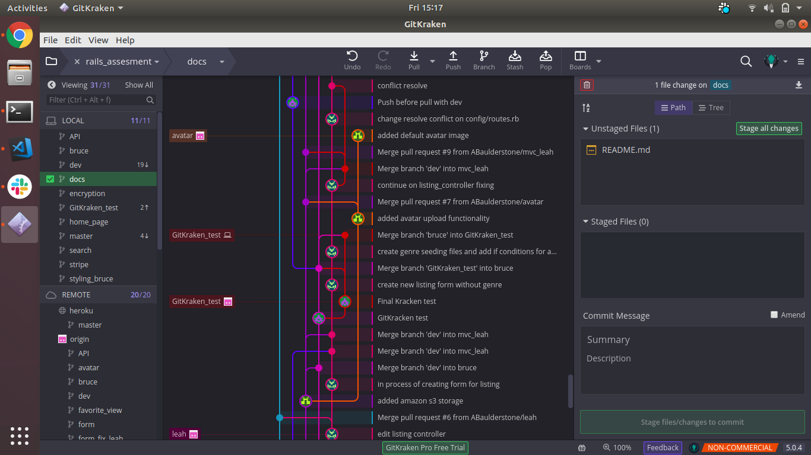
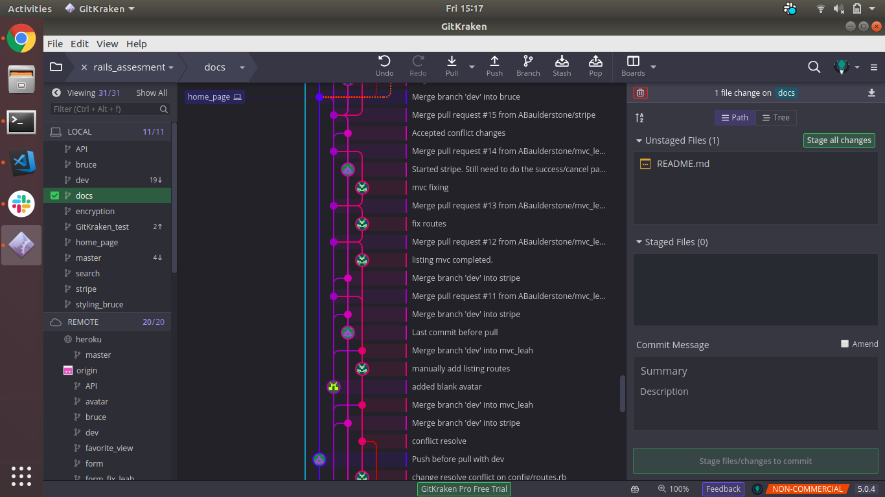

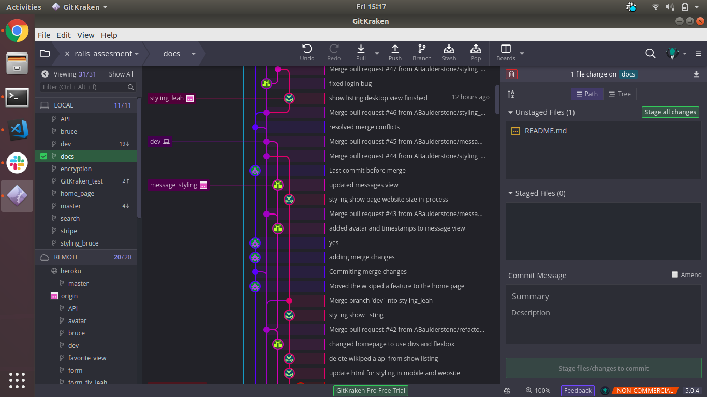
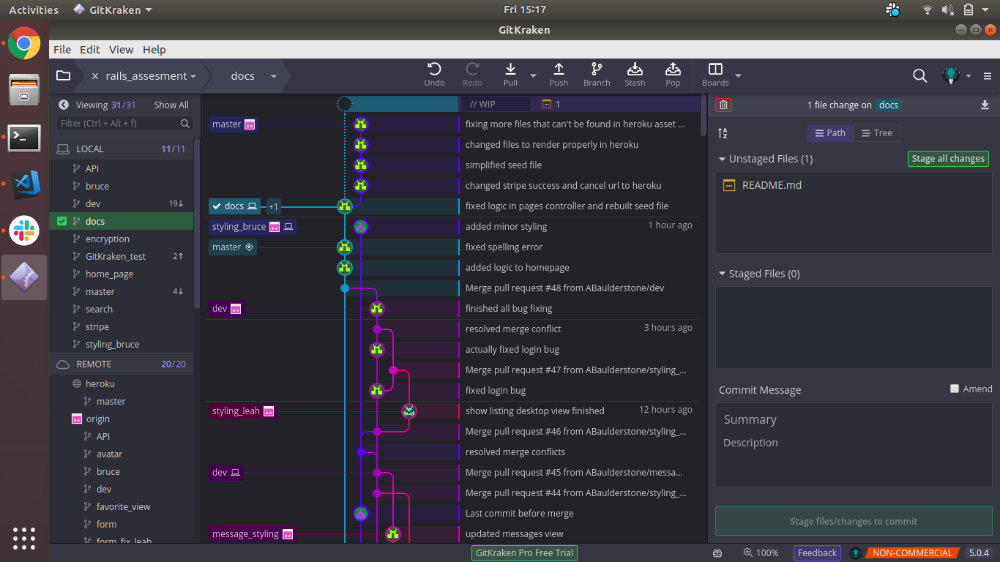
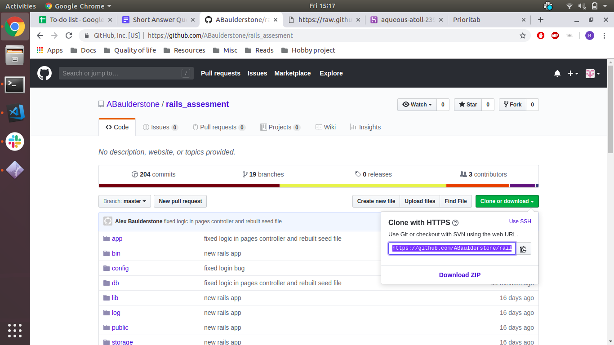

The tech stack used for source control was GIT, GitHub and GitKracken. Git was used to push/pull code to GitHub and GitKracken was used to visualise the Git repository and everything associated with it.

Initially a dev branch was created off the master branch. The dev branch was used as the main working branch, where other “feature branches” branched off of e.g. Stripe. When the feature branch was complete then it was merged into the dev branch. At the end of the working day the dev branch was merged into the master branch. This extra layer of redundancy helped protect the master branch from bugs which were caused by unforeseen edge cases on the dev branch. 

***Provide an overview and description of your Testing process.***

The testing process began with each individual feature on its own branch. Each team member responsible for that branch manually tested the feature as far as possible before merging it into the dev. This testing phase was not documented as it is still a part of the coding phase. 

The automated testing phase was conducted when all the features of the site were complete. Cypress was used for all automated tests and the team pair programmed each test. Because user stories were used as a basis for each feature, they were used again as a basis for testing each feature. The automated tests were written to go down the “happy-path” initially and then edited to test all other outcomes. 

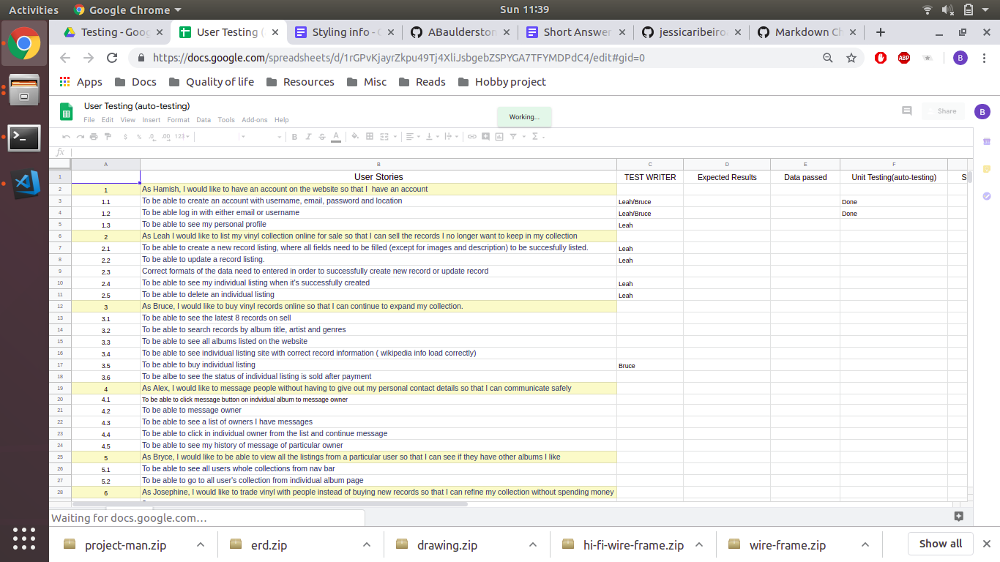

**Discuss and analyse requirements related to information system security.**

Luckily we are able to leverage the extremely powerful gem “Devise” to handle most of the heavy lifting in regards to user authentication and authorisation. It handles the sign up and registration of users then stores their encrypted password. It uses HTTP Post requests or HTTP Basic Authentication to authenticate users, as well as generating and clearing authenticity tokens through user cookies. Devise also comes with the extremely powerful “authenticate_user!” helper method which we utilised as a before action on several of our controllers to make sure a user couldn’t access data they weren’t authorised to see, or to delete or edit listings they weren’t the owner of.

We also used combinations of the “user_signed_in?” (“signed_in?” also works) and “currentuser”, and some helper methods we created like “listing_owner?” methods to dynamically alter our views. For example a user can only see the buttons that take them to delete or update a listing if they’re logged in and the creator of that listing. We also restricted things like the “purchase record” button to currently signed in users. 

**Discuss methods you will use to protect information and data.**

Ruby on rails has several in built features to protect user information and data. The first and most obvious issue is the protection against sql injection and CSRF. 

User information and images are stored in the cloud in Heroku and Amazon S3 respectively. Both services have exceptional track records in terms of security with no notable data breaches since their inception. 
The user passwords are encrypted in the Heroku storage system. The encryption is a feature of devise, which is essential for the users information security. This makes the users personal content (e.g. messages) unavailable even to the team. The messages themselves will be encrypted in an upcoming release of the app.  

**Research what your legal obligations are in relation to handling user data.**

“The NDB scheme requires entities to notify affected individuals and the Australian Information Commissioner, in the event of an ‘eligible data breach’.”

In short the company responsible for holding the data is responsible for it i.e. if there is a data breach of a users information that is stored on a local machine, then the owner of that machine is responsible for that breach. Because we have made the decision to store user information and images in the cloud the 3rd party services are then responsible for the security of that information. If there is a data breach with either of those services they are legally obligated to notify their clients whom are in turn obligated to notify their users. 
A data breach occurs when; a device containing customers’ personal information is lost or stolen, a database containing personal information is hacked, personal information is mistakenly provided to the wrong person. and personal information is mistakenly provided to the wrong person.